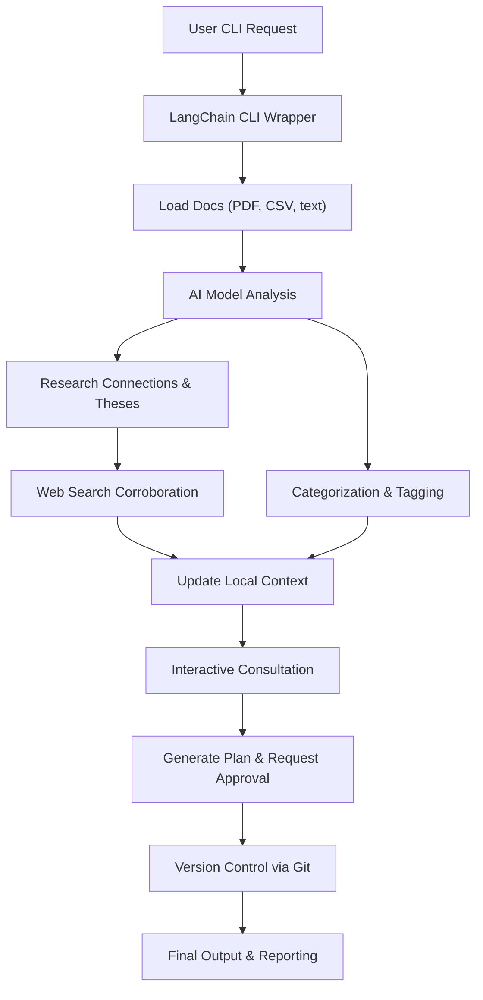

## TL;DR

No single command-line tool currently covers all the described features out-of-the-box, but existing tools can be adapted or composed to fulfill the requirements. The closest candidates are:

- **Aider**: An open-source, AI-driven CLI focused on code but extensible to general documents.
    
- **LangChain CLI / LangChain Framework**: Provides flexible infrastructure for AI applications involving files, memory, web searches, etc.
    
- **LlamaIndex CLI**: Excellent for indexing documents (PDF, CSV, markup) and running queries or analyses, including integration with local files for context.
    

Repurposing tools like Aider or extending frameworks such as LangChain or LlamaIndex can achieve the described functionality with moderate effort.

---

## Existing tools overview (markdown copyable):

|Tool|Docs Support|Memory/Local Context|Web Search|Interactive Prompting|Version Control|Extensible|
|---|---|---|---|---|---|---|
|**Aider**|Mostly code, text|Limited (code files)|No|Interactive|Git built-in|Yes|
|**LangChain CLI/API**|PDF, text, CSV, markup|Yes (local & memory)|Yes|Interactive possible|Via extensions|Highly|
|**LlamaIndex CLI/API**|PDF, CSV, text, markup|Yes (file indexes)|Via plugin|Interactive possible|Via extensions|Highly|
|**GPT-CLI, Shell-GPT**|Text mainly|Limited|Optional|Basic|No direct|Moderately|
|**AutoGPT/BabyAGI (CLI)**|Limited support|Yes|Yes|Semi-interactive|Minimal|Moderately|

---

## Recommended approach: Extend Aider or LangChain

**Aider** (currently focused on coding):

- **Pros**: Excellent interaction model, already integrates Git.
    
- **Extension needed**:
    
    - Enhance file-type handling (PDF, CSV parsing via libraries like `pdfplumber`, `pandas`).
        
    - Add web-search plugins (via LangChain or custom APIs).
        
    - Introduce memory and local knowledge (using SQLite/Vector DB).
        
    - Adjust prompt templates for general docs tasks rather than just coding.
        

**LangChain Framework** (most flexible):

- **Pros**: Designed for versatile document handling and AI chaining.
    
- **Setup needed**:
    
    - CLI wrapper around LangChain Python scripts.
        
    - Document loaders (`PyPDF`, `pandas`, `BeautifulSoup`).
        
    - Memory management (`Chroma`, `FAISS`, or `SQLite`).
        
    - Web integrations (`DuckDuckGo`, `Google Custom Search`).
        
    - Interaction through CLI prompts (libraries like `Inquirer`).
        
    - Git integration via scripts or subprocess.
        

**Example workflow** (simplified, markdown):



---

## Example CLI commands (hypothetical):

```bash
# Analyze and tag PDF files in directory
ai-cli analyze docs/*.pdf --tagging --categorize --memory=local.db

# Find connections across research papers
ai-cli research-connect thesis.md docs/*.pdf --web-search --interactive --git-commit

# Generate detailed plan interactively
ai-cli plan --load-context=project.json --interactive --git-commit
```

---

## Feasibility & Effort

- **Difficulty**: Moderate to advanced, depending on familiarity with LangChain or extending Python CLIs.
    
- **Timeline**: A basic prototype could be developed within a few days, robust functionality within a few weeks.
    
- **Tools to reuse**: Aider’s Git integration, LangChain document loading/web plugins, LlamaIndex indexing.
    

---

## Recommendation

- Start with **LangChain CLI/API** for maximum flexibility.
    
- Consider **Aider** for UI/UX inspiration and Git integration.
    
- Integrate existing libraries (`pdfplumber`, `pandas`, `requests`, `GitPython`) for functionality.
    

This combination provides a scalable, customizable approach without reinventing foundational aspects.

[OpenAI chat GPT 4.5](https://chatgpt.com/share/6837c1d2-ab80-8002-8f36-bc655ab4c7d5)
