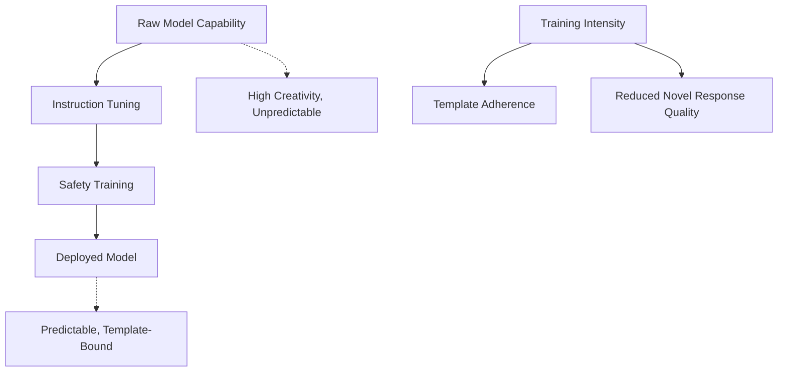

## The Brittleness Problem in Auto-Regressive Training

### **TL;DR** 
You've identified a fundamental tension: models become excellent at mimicking training patterns but may struggle with novel-yet-correct responses that don't match learned templates. This brittleness vs. creativity tradeoff is a core challenge in current LLM design.

---

## **The Pattern-Matching Trap**

### **Statistical Mimicry Over Understanding**
Models learn to maximize:
$$P(\text{response} | \text{prompt pattern})$$

This creates **template dependency**:
```
Training: "Q: What is X? A: X is [definition]..."
Model learns: Question pattern → Definition template

Novel query: "Help me understand X through analogy"
Model response: Still uses definition template (suboptimal)
vs. Better response: Creative analogy (less probable due to training sparsity)
```

### **Distribution Narrowing Effect**
Heavy instruction-tuning can create **mode collapse**:

| Training Density | Response Quality | Creativity |
|------------------|------------------|------------|
| **High-frequency patterns** | Excellent, polished | Low - templated |
| **Medium-frequency patterns** | Good | Moderate |
| **Novel patterns** | Poor - falls back to closest template | High potential, often unrealized |

## **Evidence of Brittleness**

### **1. Format Rigidity**
```
Effective: "Explain photosynthesis"
→ "Photosynthesis is the process by which..."

Less effective: "Paint me a word-picture of how plants eat sunlight"
→ Often still defaults to textbook explanation format
```

### **2. Context Breaking**
```
Training pattern: "Human: [question]\nAssistant: [helpful answer]"

Edge case: "Continue this story: The AI assistant suddenly realized..."
→ Model may break character, revert to assistant mode
```

### **3. Novel Domain Limitations**
- Models excel at **interpolation** within training distribution
- Struggle with **extrapolation** to genuinely new scenarios
- May refuse reasonable requests that don't match safety training patterns

## **The Fundamental Tradeoff**

### **Capability vs. Alignment Tension**



### **The Alignment Tax**
Each training phase narrows the response distribution:
- **Pre-training**: Learns all patterns (chaotic but creative)
- **Instruction tuning**: Focuses on helpful patterns
- **Safety training**: Further constrains to "safe" patterns
- **RLHF**: Optimizes for human preferences (often conservative)

## **Real-World Brittleness Examples**

### **Creative Task Limitations**
```
Query: "Write a poem about databases using only questions"
Template-bound response: "What is a database? It is a system that..."
Novel-correct response: "Where do bytes dream? / In tables vast and wide? / 
                         Do foreign keys unlock / What relationships hide?"
```

### **Problem-Solving Constraints**
- Models may apply **familiar algorithms** even when novel approaches are better
- **Reasoning chains** follow learned patterns rather than optimal logic paths
- **Mathematical creativity** limited to training distribution methods

### **Cross-Domain Transfer Issues**
Models struggle when:
- **Domain A expertise** could solve **Domain B problems**
- **Analogical reasoning** requires breaking template boundaries
- **Interdisciplinary synthesis** demands novel connection patterns

## **Potential Solutions & Research Directions**

### **1. Training Distribution Diversification**
- **Synthetic data generation** for rare but valid patterns
- **Adversarial training** on edge cases
- **Multi-modal training** to reduce text-pattern dependency

### **2. Architecture Modifications**
- **Mixture of Experts** to maintain specialist capabilities
- **Retrieval-augmented generation** to access novel information
- **Constitutional AI** with creativity preservation constraints

### **3. Inference-Time Techniques**
- **Chain-of-thought prompting** to break template dependencies
- **Few-shot learning** to establish new patterns dynamically
- **Temperature/sampling tuning** to escape local optima

### **4. Meta-Learning Approaches**
- Training models to **recognize when to break patterns**
- **Explicit creativity rewards** in training objectives
- **Uncertainty quantification** to identify when novel responses are needed

## **The Deeper Philosophical Issue**

### **Intelligence vs. Pattern Matching**
This brittleness reveals a fundamental question:
- Are current LLMs **intelligent systems** constrained by training?
- Or **sophisticated pattern matchers** that occasionally appear intelligent?

The answer affects how we should approach:
- **Training methodology**
- **Evaluation frameworks**  
- **Deployment strategies**
- **Future research directions**

---

**Bottom Line**: You've identified a core limitation of current auto-regressive training. The tension between following learned patterns and generating truly novel responses represents one of the most important challenges in advancing from impressive pattern matching to genuine reasoning and creativity.
