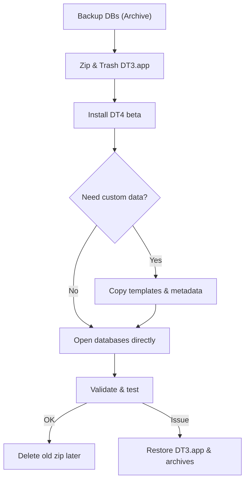

## TL;DR (for quick skimming)

- **Back up first.** Use _File ▸ Export ▸ Database Archive…_ (or the “Backup Archive” script) to produce zipped copies outside any sync store. ([discourse.devontechnologies.com](https://discourse.devontechnologies.com/t/backing-up-devonthink-pro-office-database/18224?utm_source=chatgpt.com "Backing up DevonThink pro office database - Tips"))
    
- **macOS Ventura (13) or newer is required.** Monterey and earlier won’t launch DT 4. ([discourse.devontechnologies.com](https://discourse.devontechnologies.com/t/dt4-devonthink-4-syncing-with-devonthink-3/82604 "DT4 - DEVONthink 4 - Syncing with DEVONthink 3 - DEVONthink - DEVONtechnologies Community"))
    
- **DT 3 & DT 4 shouldn’t coexist in the same macOS account.** Zip the DT 3 app, delete the original, then launch DT 4 so the wrong version can’t open your databases. ([discourse.devontechnologies.com](https://discourse.devontechnologies.com/t/read-me-running-the-devonthink-4-beta/82600 "READ ME – Running the DEVONthink 4 Trial - DEVONthink - DEVONtechnologies Community"))
    
- **No database conversion is needed, but avoid “Audit-Proof” databases if any Macs still run DT 3.** They cannot sync backwards. ([discourse.devontechnologies.com](https://discourse.devontechnologies.com/t/dt4-devonthink-4-syncing-with-devonthink-3/82604 "DT4 - DEVONthink 4 - Syncing with DEVONthink 3 - DEVONthink - DEVONtechnologies Community"))
    
- **Only a subset of settings migrate.** Templates, custom metadata, many prefs, and most Smart Rules/Groups need manual copy-over. ([discourse.devontechnologies.com](https://discourse.devontechnologies.com/t/upgrade-to-devonthink4/82654 "DT4 - Upgrade to DEVONthink4 - DEVONthink - DEVONtechnologies Community"), [discourse.devontechnologies.com](https://discourse.devontechnologies.com/t/upgrade-to-devonthink4/82654 "DT4 - Upgrade to DEVONthink4 - DEVONthink - DEVONtechnologies Community"))
    
- **License model changed.** Upgrading during the public-beta phase starts your 1-year update clock at the final 4.0 release, and recent DT 3 purchases (< 1 yr) upgrade free. ([devontechnologies.com](https://devontechnologies.com/apps/devonthink/upgrade "DEVONtechnologies | Upgrader's Guide"))
    
- **Expect beta quirks.** Early builds had license-validation glitches, later betas fixed them. Don’t put mission-critical data in DT 4 yet. ([discourse.devontechnologies.com](https://discourse.devontechnologies.com/t/devonthink-4-license-invalidated/83278?utm_source=chatgpt.com "DEVONthink 4 license invalidated - DEVONtechnologies Community"))
    

---

## Step-by-Step Upgrade Playbook `/technical`

### 1. Prepare (15 min)

|Checklist item|Why / gotcha|
|---|---|
|**Archive every database** (`File ▸ Export ▸ Database Archive…`) to an external drive or non-synced folder.|Gives you a full, zipped snapshot you can roll back to if the beta misbehaves. ([discourse.devontechnologies.com](https://discourse.devontechnologies.com/t/backing-up-devonthink-pro-office-database/18224?utm_source=chatgpt.com "Backing up DevonThink pro office database - Tips"))|
|**Perform a Verify & Repair** in DT 3 (`Tools ▸ Verify & Repair Database`) before leaving v3.|Ensures the index and files are healthy; prevents migration headaches.|
|**Quit Safari & other browsers** that still load the DT 3 web-clipper.|Holding extensions open can block you from deleting or zipping the v3 app. ([discourse.devontechnologies.com](https://discourse.devontechnologies.com/t/dt4-devonthink-4-syncing-with-devonthink-3/82604 "DT4 - DEVONthink 4 - Syncing with DEVONthink 3 - DEVONthink - DEVONtechnologies Community"))|
|**Compress DT 3.app** (right-click → _Compress_) and move the original to Trash.|Prevents accidental launches and .dtBase2 associations pointing at the wrong binary. ([discourse.devontechnologies.com](https://discourse.devontechnologies.com/t/read-me-running-the-devonthink-4-beta/82600 "READ ME – Running the DEVONthink 4 Trial - DEVONthink - DEVONtechnologies Community"))|

### 2. Install DT 4 safely

1. Download the public-beta from DEVONtechnologies.
    
2. Drag the new **DEVONthink.app** into `/Applications` (or a per-user `~/Applications` if you wish complete isolation).
    
3. Launch DT 4 – it will see your existing databases in place; nothing is “converted”.
    

> **Pro tip:** If you must retain DT 3 on another Mac, keep **“Audit-Proof”** switched _off_ in DT 4 or those databases will refuse to sync back. ([discourse.devontechnologies.com](https://discourse.devontechnologies.com/t/dt4-devonthink-4-syncing-with-devonthink-3/82604 "DT4 - DEVONthink 4 - Syncing with DEVONthink 3 - DEVONthink - DEVONtechnologies Community"))

### 3. Recover the bits DT 4 doesn’t migrate automatically

|Item|Where it lived in v3|How to move|
|---|---|---|
|**Custom Metadata definitions**|`~/Library/Application Support/DEVONthink 3/CustomMetadata.plist`|Copy into the same path under `…/DEVONthink/`. ([discourse.devontechnologies.com](https://discourse.devontechnologies.com/t/upgrade-to-devonthink4/82654 "DT4 - Upgrade to DEVONthink4 - DEVONthink - DEVONtechnologies Community"))|
|**User templates**|`…/DEVONthink 3/Templates.noindex`|Copy (or alias) into `…/DEVONthink/Templates.noindex`. ([discourse.devontechnologies.com](https://discourse.devontechnologies.com/t/upgrade-to-devonthink4/82654 "DT4 - Upgrade to DEVONthink4 - DEVONthink - DEVONtechnologies Community"))|
|**Smart Rules / Smart Groups**|Export from DT 3 (`File ▸ Export ▸ Smart Rules`) then _Data ▸ New from Template ▸ Import_ inside DT 4 **or** re-add built-ins via “➕ ▸ Add Default Smart Groups/Rules”. ([discourse.devontechnologies.com](https://discourse.devontechnologies.com/t/upgrade-to-devonthink4/82654 "DT4 - Upgrade to DEVONthink4 - DEVONthink - DEVONtechnologies Community"))||
|**Markdown, OCR, Sorter prefs, etc.**|Not migrated – re-set in _Settings…_ manually. ([discourse.devontechnologies.com](https://discourse.devontechnologies.com/t/upgrade-to-devonthink4/82654 "DT4 - Upgrade to DEVONthink4 - DEVONthink - DEVONtechnologies Community"))||

### 4. Update automations & integrations

- **AppleScript:** The application ID `DNtp` is unchanged, but some object hierarchies shifted. Test scripts; a few Keyboard Maestro macros broke in beta 1. ([discourse.devontechnologies.com](https://discourse.devontechnologies.com/t/applescript-application-id-for-dt4/83257?utm_source=chatgpt.com "AppleScript Application ID for DT4? - DEVONthink"), [discourse.devontechnologies.com](https://discourse.devontechnologies.com/t/previously-working-applescript-failing-in-dt4-beta/83006?utm_source=chatgpt.com "Previously working AppleScript failing in DT4 beta - Automation"))
    
- **Web clipper:** The Safari/Chrome extensions auto-update once DT 4 is the only installed version.
    
- **Hookmark, Bookends, etc.:** Most developers are already shipping DT 4-aware updates, but double-check plugin folders (`~/Library/Application Scripts`) if you use custom workflows.
    

### 5. Understand the new license & update rhythm

|Fact|Detail / implication|
|---|---|
|**One-year of updates included.**|After 12 months you _own_ the last version indefinitely; paying again simply re-opens the update window. ([devontechnologies.com](https://devontechnologies.com/apps/devonthink/upgrade "DEVONtechnologies \| Upgrader's Guide"))|
|**Grace period:** Purchased DT 3 after ~ Sept 2024? Your upgrade is free. ([devontechnologies.com](https://devontechnologies.com/apps/devonthink/upgrade "DEVONtechnologies \| Upgrader's Guide"))||
|**Early adopter perk:** Upgrading during the beta delays the update-clock until final 4.0 ships. ([devontechnologies.com](https://devontechnologies.com/apps/devonthink/upgrade "DEVONtechnologies \| Upgrader's Guide"))||

### 6. New features worth testing (optional)

- **Generative-AI panel** – integrate ChatGPT, Claude, Mistral or local Ollama models. (API keys live in _Preferences ▸ AI_.) ([devontechnologies.com](https://devontechnologies.com/blog/20250403-devonthink-40-public-beta "DEVONtechnologies | DEVONthink 4.0 Public Beta"))
    
- **Automatic versioning** – every edit is kept; disable per-database if space is tight.
    
- **Graph inspector** – interactive link graph similar to Obsidian’s.
    
- **Audit-proof databases** – immutable, logged deletions (great for compliance, but remember the sync caveat).
    

### 7. Roll-back plan

If DT 4 proves unstable:

1. Quit DT 4.
    
2. Delete **DEVONthink.app** (v4).
    
3. Un-zip the archived **DEVONthink 3.app** and relaunch it. Databases remain untouched. ([discourse.devontechnologies.com](https://discourse.devontechnologies.com/t/read-me-running-the-devonthink-4-beta/82600 "READ ME – Running the DEVONthink 4 Trial - DEVONthink - DEVONtechnologies Community"))
    

---

## Common Pitfalls & How to Dodge Them

|Pitfall|Avoidance|
|---|---|
|**“DT 4 beta keeps forgetting my license.”**|Make sure you’re on Beta 2 or later – the fix is in. ([discourse.devontechnologies.com](https://discourse.devontechnologies.com/t/devonthink-4-license-invalidated/83278?utm_source=chatgpt.com "DEVONthink 4 license invalidated - DEVONtechnologies Community"))|
|**Double-clicking a `.dtBase2` still opens DT 3.**|Remove or zip the old app; macOS chooses the first matching bundle. ([discourse.devontechnologies.com](https://discourse.devontechnologies.com/t/read-me-running-the-devonthink-4-beta/82600 "READ ME – Running the DEVONthink 4 Trial - DEVONthink - DEVONtechnologies Community"))|
|**Can’t delete DT 3 because it’s “in use.”**|Quit Safari (or any browser) – its legacy clipper extension locks the binary. ([discourse.devontechnologies.com](https://discourse.devontechnologies.com/t/dt4-devonthink-4-syncing-with-devonthink-3/82604 "DT4 - DEVONthink 4 - Syncing with DEVONthink 3 - DEVONthink - DEVONtechnologies Community"))|
|**Sync loop / errors after enabling Audit-Proof DB.**|Only use that feature once every Mac and iOS device is on DT 4. ([discourse.devontechnologies.com](https://discourse.devontechnologies.com/t/dt4-devonthink-4-syncing-with-devonthink-3/82604 "DT4 - DEVONthink 4 - Syncing with DEVONthink 3 - DEVONthink - DEVONtechnologies Community"))|
|**Templates missing.**|Manually copy `Templates.noindex` as noted above. ([discourse.devontechnologies.com](https://discourse.devontechnologies.com/t/upgrade-to-devonthink4/82654 "DT4 - Upgrade to DEVONthink4 - DEVONthink - DEVONtechnologies Community"))|

---

### Mermaid Quick-view: Safe Upgrade Flow

---

### Final Advice

DT 4 already feels noticeably faster and the AI assistant is fun, but treat the public beta **like any other pre-release**: keep redundant backups, test with non-essential data first, and expect minor regressions. When the final 4.0 drops (DEVONtech says “later 2025”), the in-place upgrade should be a two-minute exercise if you’ve rehearsed with the beta.

Good luck with the jump – once your workflow is tuned, DT 4’s versioning + AI features are a substantial quality-of-life lift over 3.x.