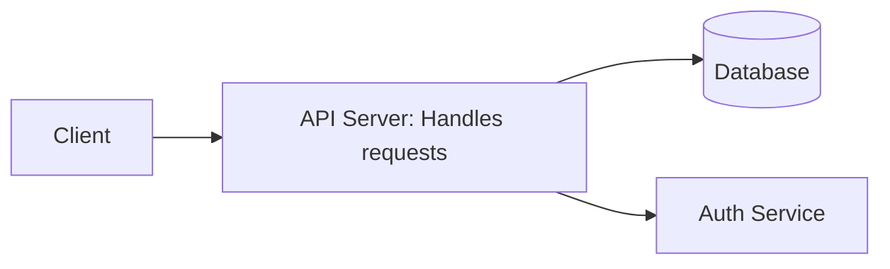

## Quick Start – GitHub Copilot **Agent Mode** in VS Code (June 2025)

### TL;DR

- **Built‑in & GA:** Agent Mode ships with VS Code 1.99 + – just sign in with Copilot.
    
- **What it does:** Plans → edits multiple files → (optionally) runs builds/tests → iterates until goals pass.
    
- **Essentials:**
    
    1. Keep a concise `.github/copilot‑instructions.md` in every repo.
        
    2. Attach prompt files (`.github/prompts/*.prompt.md`) for repeatable tasks.
        
    3. One focused chat ≈ one bug/feature; start fresh when the topic changes.
        
    4. Approve tool runs/tests; review diffs before you **Keep**.
        
    5. Provide clear goals + constraints and let the agent handle mechanics.
        

---

### 1 | Prerequisites

|Requirement|Notes|
|---|---|
|VS Code **1.99** or newer|Agent Mode is on by default; no preview flag needed.|
|GitHub Copilot seat|Individual or Business.|
|Workspace builds/tests runnable from VS Code|The agent invokes them.|

---

### 2 | Enable & Launch

1. **Open Copilot Chat** (View → Copilot).
    
2. Select **Agent** in the chat input toolbar.
    
3. Type a high‑level goal, e.g.
    
    ```markdown
    Fix failing test in #file:tests/auth_test.py and explain the root cause.
    ```
    
4. Approve any suggested terminal commands; watch live diffs; click **Keep** (or Undo) when satisfied.
    

---

### 3 | Everyday Workflow Cheatsheet

|Scenario|Prompt Skeleton|Agent will…|
|---|---|---|
|**Bug fix**|“Crash when saving user … see #file:logs/crash.txt. Find cause, patch, run tests.”|Locate code, patch, loop until tests green.|
|**New feature**|“Add `--export-csv` to analytics.py per specs below …”|Plan → update CLI → write CSV code → add tests.|
|**Doc/design**|“Draft design spec for Redis cache refactor ⇒ sections: overview, impacts, testing.”|Generate outline or full Markdown spec (Mermaid diagrams OK).|

---

### 4 | Best‑Practice Checklist

- **Repo instructions file**: `.github/copilot‑instructions.md`
    
    - Put project overview, tech stack, style must‑dos, **nothing fluffy**.
        
- **Prompt files**: drop reusable templates in `.github/prompts/`, attach via **📎 Prompt…**.
    
- **Focused chats**: one task per thread to stay within context limits.
    
- **Attach context deliberately**: `#file:path/to/code` or Add Files UI for key files/logs/specs.
    
- **Iterate & review**: ask the agent to **summarize plan first**, then refine; approve or undo edits freely.
    

---

### 5 | Handy Commands & Settings

- **Stop / Undo last edit** – toolbar icons in chat panel.
    
- **`chat.agent.maxRequests`** – cap self‑fix iterations (default 5).
    
- **`chat.promptFiles`: true** – enable prompt‑file picker if disabled.
    

---

## Appendices (reference only)

### A | Repo Instruction vs Prompt Files

|File|Purpose|Commit?|Docs|
|---|---|---|---|
|`.github/copilot‑instructions.md`|Always‑on context for every chat in repo|**Yes**|GitHub Docs – repo guidance|
|`.github/prompts/*.prompt.md`|Reusable templates attachable per chat|**Yes**|GitHub Docs – prompt files|

### B | Agent‑Mode Feature Matrix (June 2025)

|Capability|GA?|
|---|---|
|Plan ➜ multi‑file edits ➜ iterate|✅|
|Run build/test commands (user‑approved)|✅|
|Live diff streaming|✅|
|External MCP tools (3rd‑party)|⚠️ early GA|

### C | Typical Context Windows (mid‑2025)

|Model|Input tokens|
|---|---|
|OpenAI o3 / o4‑mini|200 k|
|Anthropic Claude 4 (Opus/Sonnet)|200 k|

> _Practical_: IDE scaffolding + prompt + answer reduce usable size; > 80 k often requires trimming.

### D | Neutral Benefit Statement

> Storing shared rules in `.github/copilot‑instructions.md` and using Agent Mode mean every contributor starts with the **same** project context; the agent then edits code, runs tests and refines until they pass, while you stay in control of approvals. Faster iterations, no loss of review control.

### E | Sample Mermaid Diagram



---

### Copy‑Me Markdown

> The entire response **is** pure Markdown – copy freely into your docs or wiki.